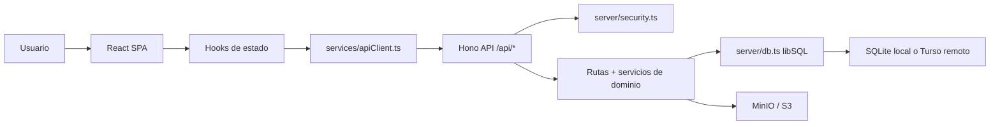

# Blueprint Arquitectonico Reusable

## 1. Proposito

Este documento describe la arquitectura base que debe replicarse en nuevos proyectos fullstack TypeScript. Fue extraida del proyecto actual, pero esta escrita para que una nueva aplicacion pueda nacer sin modulo de IA y quedar preparada para agregarlo despues como agente o pipeline especializado.

La regla de oro: copiar la arquitectura, no copiar el dominio.

## 2. Stack Base

| Capa          | Decision                                                         |
| ------------- | ---------------------------------------------------------------- |
| Frontend      | React 18 + Vite + TypeScript                                     |
| UI            | Tailwind CSS + primitivas pequeñas tipo Radix/CVA cuando aplique |
| Iconos        | `lucide-react` si hay iconos disponibles                         |
| Backend       | Hono + `@hono/node-server`                                       |
| Runtime TS    | `tsx` para dev/start                                             |
| Base de datos | `@libsql/client` con SQLite local y Turso remoto opcional        |
| Archivos      | MinIO/S3-compatible para archivos grandes                        |
| Deploy        | Docker multi-stage + Coolify                                     |
| Calidad       | Typecheck, Prettier, quality gate, scan de secrets               |

Scripts base:

```json
{
  "dev": "concurrently \"npm run dev:server\" \"npm run dev:client\"",
  "dev:client": "vite",
  "dev:server": "tsx --watch server/index.ts",
  "build": "tsc --noEmit && vite build",
  "start": "tsx server/index.ts",
  "typecheck": "tsc --noEmit && tsc -p server/tsconfig.json --noEmit",
  "format": "prettier --write \"**/*.{ts,tsx,js,jsx,json,css,md}\"",
  "format:check": "prettier --check \"**/*.{ts,tsx,js,jsx,json,css,md}\"",
  "quality": "node scripts/quality/pre-commit-check.js",
  "scan-secrets": "node scripts/quality/check-secrets.js",
  "check": "npm run typecheck && npm run format:check && npm run quality"
}
```

En proyectos nuevos, conviene que `build` ejecute el typecheck completo o que CI ejecute `npm run typecheck` antes de `npm run build`. En el proyecto origen, el backend queda cubierto por `npm run typecheck`.

## 3. Capas de la Aplicacion



Responsabilidades:

- `App.tsx`: orquestador de flujo, autenticacion, navegacion y contexto activo.
- `hooks/index.ts`: estado reusable; auth, data loading, contexto tenant, preferencias.
- `services/apiClient.ts`: unica puerta HTTP desde frontend.
- `components/ui/*`: primitivas pequenas y consistentes.
- `widget.tsx`: opcional, para exponer la app como custom element embebible.
- `server/index.ts`: arranque Hono, middlewares, rutas, health/readiness, SPA estatica en produccion.
- `server/security.ts`: hash de passwords, sesiones, roles, tenant/contexto.
- `server/db.ts`: cliente unico libSQL.
- `server/schema.ts`: DDL idempotente y migraciones ligeras.
- `server/seed.ts`: datos iniciales idempotentes.
- `server/services/*`: logica de negocio o integraciones.
- `server/routes/*`: frontera HTTP por dominio.

## 4. Estructura Recomendada

```text
.
├── App.tsx
├── index.tsx
├── index.css
├── vite.config.ts
├── tailwind.config.js
├── types.ts
├── components/
│   ├── ui/
│   └── <domain-components>.tsx
├── hooks/
│   └── index.ts
├── services/
│   ├── apiClient.ts
│   ├── authService.ts
│   └── <domain-services>.ts
├── shared/
│   └── <shared-contracts>.ts
├── server/
│   ├── index.ts
│   ├── db.ts
│   ├── schema.ts
│   ├── seed.ts
│   ├── security.ts
│   ├── httpHardening.ts
│   ├── routes/
│   ├── services/
│   └── workers/
├── scripts/
│   └── quality/
├── docs/
├── Dockerfile
├── docker-compose.yml
├── .env.example
├── AGENTS.md
└── package.json
```

## 5. Frontend

### Principios

- La SPA debe abrir en la experiencia real, no en una landing decorativa.
- Los componentes no deben llamar `fetch` directamente.
- Las llamadas HTTP viven en `services/apiClient.ts`.
- Las preferencias locales permitidas son pocas: `sessionId`, contexto activo y dark mode.
- El estado de flujo vive arriba en `App.tsx`; estado reusable vive en hooks.
- La UI debe ser operacional: clara, densa cuando haga falta, responsive y sin texto explicando funciones obvias.

### Patron de apiClient

El cliente debe:

- Usar `API_BASE = '/api'`.
- Adjuntar `X-Session-Id` en cada request autenticado.
- No forzar `Content-Type: application/json` cuando el body es `FormData`.
- Convertir errores HTTP en `ApiError`.
- Tener funciones nombradas por caso de uso, no fetch disperso.
- Manejar descargas/blobs con headers de sesion cuando aplique.

### Auth y contexto frontend

Hooks recomendados:

- `useAuth()`: restaura sesion, login, logout, `sessionReady`.
- `useApiData()`: carga datos base en paralelo al autenticar.
- `useTenantContext()` o `useAgencyContext()`: contexto operativo activo.
- `useDarkMode()`: preferencia local.
- `useConfirmDialog()`: confirmaciones uniformes.

Roles base:

- `ADMIN`: acceso global.
- `OPERADOR`: acceso operativo acotado.
- `SUPERVISOR`: acceso de revision/seguimiento.

El nombre del tenant puede cambiar: agencia, cliente, organizacion, sucursal, bodega, proyecto.

### Primitivas UI

Copiar como patron, no como obligacion exacta:

- `lib/utils.ts` con `cn`.
- `components/ui/button.tsx` con variantes CVA.
- `badge`, `tooltip`, `progress`, `scroll-area`, `separator`, `skeleton`.
- `PageHeader` o equivalente para cabeceras de pantalla.

### Widget Embebible Opcional

Si la app debe incrustarse en otra web:

- Crear `widget.tsx`.
- Registrar un custom element.
- Usar Shadow DOM.
- Inyectar CSS inline con `index.css?inline`.
- Montar `App` en modo widget con props como `isWidgetMode`, `isOpen`, `onClose`.

No incluir widget si el producto no necesita embebido.

## 6. Backend Hono

### server/index.ts

Debe incluir:

- `dotenv/config`.
- `new Hono()`.
- `securityHeaders()`.
- CORS solo para dev sobre `/api/*`.
- Rate limits para rutas sensibles.
- `app.route('/api/<domain>', domainRoutes)`.
- `GET /api/health` como liveness simple.
- `GET /api/ready` como readiness real.
- `serveStatic({ root: './dist' })` en produccion si existe `dist/`.
- Fallback SPA para rutas no API.
- `runMigrations(db)` y `runSeed(db)` al iniciar.
- Graceful shutdown con `closeDb()` y stop de workers.

### Rutas

Patron por archivo:

```ts
const route = new Hono();

route.get('/', async (c) => {
  const userOrRes = await requireAuth(c);
  if (userOrRes instanceof Response) return userOrRes;

  // validar rol/contexto si aplica
  // query parametrizada
  return c.json(result);
});

export default route;
```

Reglas:

- Rutas HTTP parsean input, validan permisos y devuelven JSON.
- Servicios contienen logica de negocio reutilizable.
- DB se toca con queries parametrizadas.
- No filtrar stack traces al cliente.
- Cualquier ruta con datos protegidos usa `requireAuth`.
- Cualquier ruta admin usa `requireRole`.
- Cualquier ruta multi-tenant usa `ensureAgencyAccess` o equivalente.

## 7. Seguridad

### Passwords

Usar `node:crypto` con scrypt:

- Formato persistido: `scrypt$<salt_hex>$<hash_hex>`.
- Comparacion con `timingSafeEqual`.
- Migracion transparente si hay passwords seed legacy.

### Sesiones

La arquitectura usa sesiones opacas en DB:

- Tabla `auth_sessions`.
- Session ID UUID.
- Expiracion, por ejemplo 8 horas.
- Header `X-Session-Id`.
- No JWT obligatorio.
- No cookies obligatorias.

Flujo:

1. `POST /api/auth/login` valida email/password.
2. Crea fila en `auth_sessions`.
3. Devuelve `session.id` y usuario.
4. Frontend guarda `sessionId` en memoria y localStorage.
5. `apiClient` envia `X-Session-Id`.
6. `requireAuth` valida DB y carga usuario/contextos.
7. `DELETE /api/auth/session` borra la sesion.

### Hardening HTTP

Headers recomendados:

- `X-Request-Id`
- `X-Frame-Options: DENY`
- `X-Content-Type-Options: nosniff`
- `Referrer-Policy: strict-origin-when-cross-origin`
- `Permissions-Policy: camera=(), microphone=(), geolocation=()`
- `Cross-Origin-Opener-Policy: same-origin`

Rate limits recomendados:

- Login: obligatorio.
- Integraciones externas: obligatorio.
- Operaciones costosas: segun dominio.
- Upload masivo: controlar por tamano, cantidad y cola, no necesariamente por rate/hour.

## 8. Base de Datos

### Conexion

`server/db.ts` debe ser singleton:

```ts
createClient({
  url: process.env.TURSO_DATABASE_URL || 'file:./data/app.db',
  authToken: process.env.TURSO_AUTH_TOKEN || undefined,
});
```

Modos:

- Local barato: `file:./data/app.db`.
- Produccion simple en Coolify: SQLite local persistido en `/app/data`.
- Produccion separada: Turso remoto `libsql://...` + token.

### Migraciones

Reglas:

- Todo DDL debe ser idempotente.
- Usar `CREATE TABLE IF NOT EXISTS`.
- Usar `CREATE INDEX IF NOT EXISTS`.
- Para columnas nuevas, usar helper `ensureColumn`.
- Activar `PRAGMA foreign_keys = ON`.
- Activar `PRAGMA journal_mode = WAL`.
- Documentar cambios en `docs/DatabaseSchema.md`.

Tablas base recomendadas:

| Tabla                       | Uso                                               |
| --------------------------- | ------------------------------------------------- |
| `users`                     | Usuarios, password hash, rol, estado.             |
| `tenants` o `agencies`      | Cliente/contexto operativo.                       |
| `user_tenants`              | Relacion M:N usuario-contexto.                    |
| `auth_sessions`             | Sesiones activas.                                 |
| `subscription_plans`        | Planes si el producto necesita limites/tiers.     |
| `app_settings`              | Key-value de configuracion.                       |
| `audit_logs`                | Auditoria de acciones relevantes.                 |
| `integration_delivery_logs` | Logs de llamadas externas si hay integraciones.   |
| `file_jobs`                 | Cola persistente si hay archivos/procesos largos. |

## 9. MinIO / S3-Compatible

Usar MinIO para archivos grandes:

- PDFs, imagenes, adjuntos, exportaciones.
- SQLite/libSQL guarda metadata y object keys, no blobs pesados.
- Bucket se asegura al iniciar o antes de primer uso.
- Object keys deben ser saneadas y organizadas por tenant/fecha/id.

Variables base:

```env
MINIO_ENDPOINT=localhost
MINIO_PORT=9000
MINIO_ACCESS_KEY=replace-with-minio-user
MINIO_SECRET_KEY=replace-with-minio-password
MINIO_BUCKET=app-files
MINIO_USE_SSL=false
```

Patron de key:

```text
documents/<tenant>/<yyyy>/<mm>/<uuid>-<safe-file-name>
```

## 10. Workers y Colas

Si una operacion tarda mas que un request normal, usar cola persistente:

- Tabla `file_jobs` o `document_jobs`.
- Estados: `UPLOADED`, `QUEUED`, `PROCESSING`, `SUCCESS`, `ERROR`, `CANCELLED`.
- Worker backend con poll interval y concurrencia configurable.
- Locks con `locked_by` y `lock_expires_at`.
- Reset de jobs `PROCESSING` interrumpidos.
- Resultado JSON y error persistidos.

Variables:

```env
WORKER_ENABLED=true
WORKER_POLL_MS=7000
WORKER_CONCURRENCY=5
WORKER_JOB_TIMEOUT_MS=300000
WORKER_STALE_PROCESSING_MS=2100000
```

En apps sin IA, este patron sirve para importaciones, reportes, procesamiento de archivos, sincronizaciones o integraciones.

## 11. Integraciones Externas

Si una app permite configurar webhooks/endpoints por cliente:

- Guardar config JSON normalizada en DB.
- Validar URL, metodo, auth y headers.
- Bloquear SSRF:
  - `localhost`
  - loopback
  - redes privadas
  - link-local
  - rangos reservados
  - redirects automaticos
- Guardar logs de entrega.
- Truncar response body.
- Mensaje usuario generico, detalle tecnico en log.

## 12. Docker y Coolify

### Dockerfile

Patron:

- `node:20-alpine` builder.
- `npm ci`.
- `npm run build`.
- runtime con `npm ci --omit=dev`.
- copiar `dist`, `server`, `services`, `shared`, `types.ts`.
- `VOLUME ["/app/data"]`.
- `EXPOSE 3001`.
- `HEALTHCHECK` a `/api/ready`.
- `dumb-init`.
- `CMD ["npm", "run", "start"]`.

Nota operativa: si hay volumen SQLite existente en Coolify, no cambiar a usuario non-root sin validar permisos/ownership de `/app/data`.

### docker-compose.yml

Servicios:

- `app`: build desde Dockerfile, puerto `3001`, volumen `app_data:/app/data`.
- `minio`: `minio/minio`, volumen `minio_data:/data`, expone internamente `9000` y `9001`.

Mejoras recomendadas para proyectos nuevos:

- Parametrizar credenciales MinIO con env vars/secretos.
- Fijar tag de MinIO en vez de `latest`.
- Mantener un solo compose canonico: `docker-compose.yml` o `docker-compose.yaml`, no ambos.
- No pegar salidas de `docker compose config` en chats/tickets porque pueden contener secretos resueltos.

En Coolify:

- Metodo: Docker Compose.
- Port: `3001`.
- Healthcheck Path: `/api/ready`.
- Base Directory: `/`.
- Persistir `/app/data`.

## 13. Health y Readiness

Separar:

- `/api/health`: proceso HTTP vivo.
- `/api/ready`: dependencias listas para operar.

Readiness debe revisar:

- DB responde `SELECT 1`.
- MinIO configurado y bucket disponible si la app depende de archivos.
- Worker activo si `WORKER_ENABLED=true`.
- Integraciones criticas si son obligatorias para operar.

## 14. IA Como Addon Futuro

No meter IA en la base si el producto no la necesita al inicio.

Cuando se agregue:

- API key solo backend.
- Ruta separada: `/api/ai/*` o modulo equivalente.
- Prompts en `services/agentPrompts.ts` o `server/services/prompts/*`.
- Schema compartido en `shared/*Schema.ts`.
- Validacion deterministica despues del modelo.
- Versionado de prompt/schema.
- Telemetria de tokens/costo/duracion/error.
- Golden tests antes de tocar prompts.
- Worker/cola si el flujo tarda o procesa archivos.

Co-cambio obligatorio en features IA:

| Cambio            | Tambien actualizar                                       |
| ----------------- | -------------------------------------------------------- |
| Output shape IA   | schema compartido, tipos, UI, tests, docs DB si persiste |
| Prompt            | golden tests, version/hash, docs de comportamiento       |
| Modelo/SDK        | env vars, timeouts, fallback, observabilidad             |
| Scoring/confianza | validadores backend, UI, auditoria                       |

## 15. Skills y Agentes Reutilizables

Paquete base no-IA:

- `hono`
- `react-best-practices`
- `tailwind-css-patterns`
- `vite`
- `turso-libsql`
- `database-migrations`
- `deployment-patterns`
- `docker-patterns`
- `e2e-testing`
- `continuous-learning`

Paquete opcional IA:

- `cost-aware-llm-pipeline`
- `ai-regression-testing`
- `customs-trade-compliance` u otro dominio especifico
- `optional-ai-agent-upgrade` de este kit

Agentes/comandos utiles a portar:

- Arquitectura: `architect`, `planner`, `type-design-analyzer`.
- Exploracion: `code-explorer`, `explore`.
- Calidad: `typescript-reviewer`, `code-reviewer`, `security-reviewer`.
- Datos: `database-reviewer`.
- Operacion: `build-error-resolver`, `e2e-runner`, `performance-optimizer`.
- Aprendizaje: `conversation-analyzer`, `doc-updater`, `continuous-learning`.

## 16. Quality Gates

Antes de cerrar una tarea:

```bash
npm run check
npm run typecheck
npm run format:check
npm run quality
npm run scan-secrets
npm run build
```

Si hay cambios de DB:

- Revisar `server/schema.ts`.
- Probar migracion sobre DB vacia.
- Probar migracion sobre DB existente.
- Actualizar `docs/DatabaseSchema.md`.

Si hay cambios de deploy:

- Actualizar `Dockerfile`, `docker-compose.yml`, `.env.example`, README y docs de Coolify.
- Verificar `/api/health` y `/api/ready`.

## 17. Drifts a Evitar

En el proyecto origen se detectaron puntos que una plantilla futura debe dejar claros:

- `/api/health` no es readiness; Coolify debe usar `/api/ready`.
- Algunas notas antiguas mencionan modelos/agentes previos; confiar en frontmatter real y docs actuales.
- Roadmaps IA deben marcarse como futuro/opcional, no como estado actual.
- No copiar tablas de facturas/productos si el dominio nuevo no las necesita.
- No copiar prompts de IA a proyectos sin IA.
- No cambiar usuario runtime Docker si hay volumen SQLite existente sin validar permisos.
- No copiar credenciales fijas de MinIO.
- No copiar seeds con password `1234`; para nuevos proyectos usar bootstrap por env o forzar rotacion inicial.
- No asumir que `npm run build` valida backend si el tsconfig root excluye `server/`.

## 18. Contrato Para Nuevas Apps

Una nueva app creada con este blueprint esta completa cuando:

- Tiene login funcional con sesiones DB.
- Tiene roles y tenant/contexto.
- Tiene CRUD minimo del dominio.
- Tiene DB local en `file:./data/app.db`.
- Puede cambiar a Turso con env vars.
- Sirve API + SPA desde un solo proceso en produccion.
- Tiene Dockerfile y Compose listos para Coolify.
- Usa `/api/ready` como readiness.
- Guarda archivos grandes en MinIO si maneja archivos.
- Pasa `npm run check`.
- Pasa `npm run build`.
- Pasa `npm run scan-secrets` en modo estricto si existe.
- Tiene docs sincronizados.
