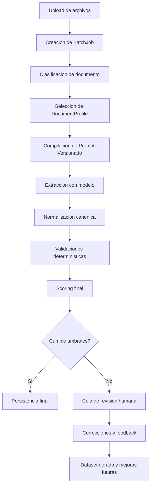

# Guia exhaustiva de evolucion de la arquitectura IA

## 1. Proposito de esta guia

Esta guia define una ruta de evolucion tecnica para la capa de extraccion documental con IA del proyecto Smart Logistics Extractor.

Su objetivo no es describir solo el estado actual, sino dejar una referencia util para futuras iteraciones del codigo con estas propiedades:

- escalable cuando aumente el numero de facturas, clientes y layouts
- mantenible cuando cambien prompts, reglas y validaciones
- trazable para saber que version produjo cada resultado
- testeable para evitar regresiones al mejorar un caso y romper otro
- incremental para que el equipo no tenga que reescribir todo de una sola vez

Esta guia complementa, no reemplaza, estos documentos existentes:

- `docs/AIAgentsFutureUpgradePlan.md` -> diagnostico y direccion de evolucion
- `docs/AgentScenarios.md` -> reglas y escenarios de razonamiento actuales
- `docs/GuiaReplicacionArquitectura.md` -> patron transaccional general del repo

---

## 2. Resumen ejecutivo

La recomendacion arquitectonica principal es esta:

**No evolucionar hacia "skills" de Copilot como pieza de runtime del producto.**

La direccion correcta para este proyecto es:

1. pasar de `AgentType` a `DocumentProfile` o `ExtractionStrategy`
2. mantener un solo motor de extraccion IA por ahora
3. separar claramente extraccion generativa, validacion deterministica, scoring y trazabilidad
4. mover la orquestacion batch al backend cuando el volumen lo justifique
5. crear un sistema de versionado de prompts, schema y reglas
6. construir un dataset dorado de regresion antes de crecer demasiado en numero de formatos

En terminos practicos: hoy el sistema no necesita un multiagente complejo; necesita una arquitectura por etapas con contratos claros.

---

## 3. Diagnostico del sistema actual

### 3.1 Lo que esta bien hoy

- El backend protege la llamada al modelo y la API key.
- La respuesta estructurada con schema reduce variabilidad.
- El prompt ya contiene conocimiento de negocio real.
- El producto ya tiene una base transaccional sana: React + Hono + libSQL/Turso + seguridad centralizada.
- La UX actual ya soporta procesamiento batch con concurrencia controlada en frontend.

### 3.2 Lo que hoy limita la escalabilidad

- `AgentType` representa mas bien variantes de prompt que agentes especializados reales.
- El conocimiento del dominio vive en un prompt monolitico que crecera mal.
- No hay versionado formal de prompt, schema, modelo ni reglas.
- No hay trazabilidad fuerte para auditar porque un documento salio bien o mal.
- La validacion matematica y la extraccion generativa estan demasiado mezcladas conceptualmente.
- Falta una capa dedicada para clasificacion de formatos.
- El batch aun depende del frontend como coordinador operativo.

### 3.3 Lectura correcta del estado actual

Hoy el sistema funciona asi:

- el usuario carga archivos
- la UI elige un `AgentType`
- el backend construye un prompt segun ese tipo
- Gemini devuelve un JSON segun un schema comun
- el frontend consume el resultado y continua el flujo

Eso quiere decir que hoy tienes:

- un solo pipeline de extraccion
- un solo schema canonico de salida
- pocas variantes activas de prompt
- cero separacion fuerte entre perfil documental, prompt versionado, validadores y scoring

La conclusion importante es esta:

**Tu siguiente mejora estructural no es "mas agentes". Tu siguiente mejora estructural es "mas capas claras".**

---

## 4. Principios arquitectonicos que deben regir el futuro

Toda mejora futura deberia respetar estos principios.

### 4.1 Separar lo generativo de lo deterministico

El modelo debe hacer lo que el codigo no puede hacer facilmente:

- leer layouts variables
- inferir relaciones visuales
- resolver ambiguedad documental

El codigo deterministico debe hacer lo que siempre puede hacerse sin IA:

- recalculos matematicos
- validacion de totales
- scoring por reglas
- normalizacion de campos
- deteccion de inconsistencias repetibles

### 4.2 Versionar todo lo que impacta resultados

Cada extraccion futura debe poder responder:

- que perfil documental se uso
- que version de prompt se uso
- que version de schema se uso
- que modelo se uso
- que validaciones pasaron o fallaron
- que postprocesos se aplicaron

### 4.3 Mantener un contrato canonico de salida

El schema de salida debe permanecer estable todo el tiempo posible.

Si un nuevo tipo de factura necesita mas datos, la preferencia debe ser:

1. extender de forma compatible el schema
2. guardar metadatos especificos en una seccion opcional
3. versionar schema solo si el contrato cambia de verdad

### 4.4 Preferir evolucion por fases sobre reescritura

Cada iteracion debe:

- dejar el sistema actual funcionando
- mejorar una capa concreta
- agregar trazabilidad y pruebas
- evitar reestructuraciones masivas sin beneficio inmediato

### 4.5 Disenar para multiples familias de documento, no para documentos individuales

No conviene crear un perfil nuevo por cada cliente si no hay una diferencia estructural real.

Conviene modelar por:

- familia visual de layout
- familia de reglas comerciales
- familia de comportamiento matematico

---

## 5. Modelo objetivo recomendado

La arquitectura futura recomendada es un pipeline por etapas.



### 5.1 Resultado buscado

El sistema debe evolucionar desde un flujo "prompt unico + schema unico" a un flujo con estas responsabilidades independientes:

1. **orquestacion**
2. **clasificacion**
3. **extraccion**
4. **normalizacion**
5. **validacion**
6. **scoring**
7. **revision humana**
8. **observabilidad**
9. **aprendizaje de iteraciones futuras**

---

## 6. Bloques funcionales de la arquitectura futura

### 6.1 BatchJob

Es la entidad que representa una carga de multiples documentos.

Debe incluir como minimo:

- `jobId`
- `createdBy`
- `agencyId`
- `status`
- `totalItems`
- `processedItems`
- `successItems`
- `errorItems`
- `createdAt`
- `updatedAt`

Estados recomendados:

- `PENDING`
- `RUNNING`
- `COMPLETED`
- `PARTIAL_SUCCESS`
- `FAILED`
- `CANCELLED`

### 6.2 BatchJobItem

Representa cada archivo del lote.

Debe guardar:

- nombre de archivo
- hash del archivo o identificador estable
- estado por item
- perfil seleccionado o clasificado
- intento actual
- total de reintentos
- resultado final
- error final
- timestamps por etapa

Estados recomendados:

- `PENDING`
- `CLASSIFYING`
- `EXTRACTING`
- `VALIDATING`
- `SUCCESS`
- `RETRYING`
- `ERROR`
- `REVIEW_REQUIRED`

### 6.3 DocumentProfile

Esta debe ser la nueva abstraccion principal en lugar de `AgentType`.

Un `DocumentProfile` representa una familia de documentos con comportamiento similar.

Debe contener:

- `id`
- `name`
- `description`
- `documentFamily`
- `promptTemplateId`
- `schemaVersion`
- `validatorSet`
- `postProcessorSet`
- `classifierHints`
- `enabled`
- `version`

Ejemplos de perfiles futuros:

- `ROSE_STANDARD_INVOICE`
- `GROUPED_VALUE_INVOICE`
- `MASTER_BOX_DISTRIBUTION`
- `CUSTOMS_SUPPORT_DOC`

### 6.4 PromptTemplate y PromptVersion

El prompt no debe vivir como un bloque unico y anonimo.

Debe separarse en:

- `PromptTemplate`: estructura base reutilizable
- `PromptVersion`: snapshot exacto de instrucciones utilizadas

Cada ejecucion debe registrar:

- `promptTemplateId`
- `promptVersion`
- texto final compilado
- features activadas

### 6.5 ExtractionRun

Representa una ejecucion puntual del modelo sobre un documento.

Debe guardar:

- `runId`
- `jobItemId`
- `profileId`
- `promptVersion`
- `schemaVersion`
- `modelId`
- `startedAt`
- `finishedAt`
- `latencyMs`
- `rawResponse`
- `parsedResponse`
- `tokenUsage` si esta disponible
- `providerError` si fallo

### 6.6 Normalizer

Es una capa de codigo que transforma la respuesta del modelo al contrato canonico del sistema.

Responsabilidades:

- normalizar tipos de caja
- limpiar strings
- asegurar defaults razonables
- convertir fechas a formato consistente
- redondear y normalizar precision numerica

### 6.7 Validators

Son reglas deterministicas ejecutadas despues de la extraccion.

Tipos recomendados:

- validadores de estructura
- validadores matematicos
- validadores de consistencia header/footer
- validadores de negocio por agencia o cliente
- validadores de integridad de line items

Cada validador debe producir un resultado estructurado:

- `ruleId`
- `severity`
- `passed`
- `message`
- `details`

### 6.8 ScoreEngine

El score final no deberia quedar solo en manos del modelo.

El sistema debe calcular el score final en codigo usando:

- calidad estructural del parseo
- discrepancias matematicas
- hallazgos criticos
- ambiguedad de clasificacion
- cantidad de campos faltantes

### 6.9 Review Queue

Debe existir una cola de revision humana para casos de baja confianza o conflictos fuertes.

Un documento debe pasar a revision si:

- falla validaciones criticas
- cae por debajo de un umbral de score
- el clasificador tiene baja confianza
- el documento cae en un perfil no reconocido

### 6.10 Learning Loop

Las correcciones humanas no deben perderse.

Conviene guardar:

- campo corregido
- valor original
- valor corregido
- razon de correccion
- perfil documental
- version de prompt que fallo

Eso se convierte despues en material para:

- mejorar prompts
- ajustar validadores
- crear nuevos perfiles
- ampliar dataset de regresion

---

## 7. Estructura de carpetas recomendada

Una evolucion ordenada podria converger hacia algo como esto:

```text
server/
  ai/
    classifier/
      classifyDocument.ts
      profileHints.ts
    profiles/
      index.ts
      roseStandard.ts
      groupedValue.ts
      masterBox.ts
    prompts/
      compiler.ts
      sections.ts
      versions/
        roseStandard.v1.ts
        groupedValue.v1.ts
    engine/
      runExtraction.ts
      parseModelResponse.ts
    normalizers/
      invoiceNormalizer.ts
      boxTypeNormalizer.ts
    validators/
      totalsValidator.ts
      eqValidator.ts
      lineItemValidator.ts
      index.ts
    scoring/
      computeScore.ts
    jobs/
      createBatchJob.ts
      processBatchJob.ts
      retryJobItem.ts
    persistence/
      extractionRunsRepo.ts
      batchJobsRepo.ts
      reviewQueueRepo.ts
    review/
      enqueueForReview.ts
      applyManualCorrection.ts
shared/
  ai/
    contracts.ts
    schema/
      invoiceExtractionSchema.ts
```

### 7.1 Regla importante de organizacion

La IA de runtime debe vivir principalmente bajo `server/ai/`.

No conviene mantener indefinidamente la logica central de extraccion en un archivo generico de `services/` si su consumo real es del backend.

---

## 8. Contratos de datos recomendados

### 8.1 Contrato de perfil documental

Ejemplo conceptual:

```ts
export interface DocumentProfile {
  id: string;
  version: number;
  name: string;
  documentFamily: string;
  description: string;
  promptTemplateId: string;
  promptVersion: string;
  schemaVersion: string;
  validatorIds: string[];
  postProcessorIds: string[];
  classifierHints: string[];
  enabled: boolean;
}
```

### 8.2 Contrato de resultado de validacion

```ts
export interface ValidationResult {
  ruleId: string;
  severity: 'INFO' | 'WARNING' | 'ERROR' | 'CRITICAL';
  passed: boolean;
  message: string;
  details?: Record<string, unknown>;
}
```

### 8.3 Contrato de corrida de extraccion

```ts
export interface ExtractionRun {
  runId: string;
  jobItemId: string;
  profileId: string;
  promptVersion: string;
  schemaVersion: string;
  modelId: string;
  status: 'SUCCESS' | 'ERROR';
  rawResponse?: string;
  parsedResponse?: unknown;
  validatorResults: ValidationResult[];
  latencyMs: number;
  startedAt: string;
  finishedAt: string;
}
```

---

## 9. Regla de decision para futuras mejoras

Cuando aparezca un nuevo caso documental, no conviene reaccionar siempre creando otro prompt completo. Hay que decidir en que capa cae el cambio.

### 9.1 Crear una nueva version de prompt cuando

- el mismo tipo de documento necesita instrucciones mas claras
- el layout es parecido pero hay ambiguedades nuevas
- no cambia el contrato de salida
- el comportamiento esperado sigue dentro de la misma familia documental

### 9.2 Crear un nuevo DocumentProfile cuando

- cambia de forma real la estructura visual del documento
- cambia el comportamiento matematico del documento
- cambian columnas o relaciones base de extraccion
- las reglas de negocio dejan de ser equivalentes a otro perfil existente

### 9.3 Crear un nuevo validador cuando

- la regla puede calcularse en codigo de forma estable
- la inconsistencia no deberia delegarse al modelo
- la regla se puede aplicar a varios perfiles

### 9.4 Versionar schema cuando

- cambia el contrato publico esperado por el frontend o la persistencia
- aparece una nueva entidad o subestructura incompatible
- ya no alcanza con un campo opcional compatible hacia atras

### 9.5 Crear revision humana cuando

- el caso es raro y caro de automatizar
- los errores tienen impacto comercial u operativo alto
- la precision del modelo sola no es suficiente para cerrar el proceso

---

## 10. Flujo operativo recomendado para cada iteracion futura

Cada nueva mejora del sistema deberia seguir este flujo estable.

### Paso 1. Capturar evidencia real

Antes de tocar codigo, reunir:

- PDFs reales del caso nuevo
- resultado actual del sistema
- errores detectados
- resultado esperado

### Paso 2. Clasificar el tipo de problema

Preguntas obligatorias:

- es un problema de clasificacion de perfil?
- es un problema de prompt?
- es un problema de normalizacion?
- es un problema de validacion matematica?
- es un problema de schema?
- es un problema de UX de revision?

### Paso 3. Elegir la capa minima correcta

No arreglar con prompt lo que debe ir en codigo.

No crear un perfil nuevo si solo hace falta una version nueva de prompt.

No tocar schema si basta con metadatos opcionales.

### Paso 4. Agregar o ajustar dataset dorado

Cada caso nuevo debe entrar a una suite de regresion con:

- input real o anonimizado
- output esperado
- tolerancias de calculo si aplican
- checks criticos obligatorios

### Paso 5. Implementar y medir

Despues del cambio, comparar:

- precision del caso nuevo
- impacto en perfiles existentes
- latencia
- tasa de documentos enviados a revision manual

### Paso 6. Liberar con trazabilidad

La liberacion debe registrar:

- perfil afectado
- prompt version nueva
- reglas nuevas
- fecha
- motivo del cambio

### Paso 7. Monitorear en produccion

Durante los primeros dias mirar:

- errores por perfil
- score promedio por perfil
- documentos con validaciones criticas
- tasa de reintentos
- tiempo total por lote

---

## 11. Roadmap recomendado por fases

Este roadmap esta pensado para ejecutarse sin romper el producto actual.

### Fase 0. Endurecer el estado actual

Objetivo: estabilizar antes de crecer.

Acciones:

- alinear documentacion con el batch actual en frontend
- mover reintentos reales al backend de extraccion
- guardar `modelId`, `promptVersion` y `schemaVersion` en cada corrida
- guardar la respuesta cruda del modelo para debugging
- normalizar logs de error por documento

Resultado esperado:

- mejor trazabilidad sin cambiar UX ni arquitectura mayor

### Fase 1. Renombrar la abstraccion principal

Objetivo: dejar de pensar en agentes y pasar a perfiles documentales.

Acciones:

- introducir `DocumentProfile` como nuevo lenguaje del dominio
- mantener compatibilidad temporal con `AgentType`
- mover configuraciones de perfiles a un modulo propio
- separar metadatos del perfil de la compilacion del prompt

Resultado esperado:

- el equipo deja de mezclar marketing de "agentes" con arquitectura runtime real

### Fase 2. Separar prompt, normalizacion y validacion

Objetivo: bajar complejidad del prompt monolitico.

Acciones:

- extraer normalizadores de codigo para box type, fechas y numericos
- crear validadores deterministas por reglas reutilizables
- calcular el `confidenceScore` final en codigo, no solo en el modelo
- dejar que el modelo se concentre en leer e inferir

Resultado esperado:

- mejor mantenibilidad y menos fragilidad ante nuevos layouts

### Fase 3. Introducir clasificacion de perfiles

Objetivo: reducir seleccion manual y preparar crecimiento.

Acciones:

- crear un clasificador inicial por heuristicas y pistas textuales
- permitir override manual desde UI al principio
- persistir `classifierConfidence` y `classifierReason`

Resultado esperado:

- sistema listo para multiples familias documentales sin explosion manual de opciones

### Fase 4. Llevar orquestacion batch al backend

Objetivo: soportar lotes medianos y grandes con mejor resiliencia.

Acciones:

- crear tablas `batch_jobs` y `batch_job_items`
- crear endpoints para crear job, consultar progreso y cancelar job
- crear worker de procesamiento interno con concurrencia controlada
- mover reintentos y control de estado al servidor

Resultado esperado:

- el navegador deja de ser el coordinador principal del proceso

### Fase 5. Construir trazabilidad completa

Objetivo: poder auditar cada resultado.

Acciones:

- persistir `ExtractionRun`
- persistir resultados de validacion por regla
- persistir latencia, errores y artefactos relevantes
- habilitar comparacion entre versiones de prompt o perfil

Resultado esperado:

- debugging mucho mas rapido y decisiones de mejora basadas en evidencia

### Fase 6. Suite de evaluacion y regresion

Objetivo: evitar romper perfiles existentes.

Acciones:

- crear dataset dorado versionado
- definir metricas por campo y por perfil
- comparar nuevas versiones contra baseline
- bloquear despliegues si degradan checks criticos

Resultado esperado:

- mejoras seguras y repetibles

### Fase 7. Human in the loop

Objetivo: cerrar el ciclo entre automatizacion y operacion humana.

Acciones:

- cola de revision
- captura de correcciones
- taxonomia de errores
- conversion de correcciones en nuevas pruebas o nuevas reglas

Resultado esperado:

- aprendizaje acumulativo real del producto

### Fase 8. Escalado avanzado

Objetivo: prepararse para volumen real sostenido.

Acciones:

- almacenamiento de archivos fuera del request principal si hace falta
- colas o workers dedicados
- rate limiting por proveedor de IA
- cachas de clasificacion o templates si aporta valor
- particion por agencia o tenant si el volumen lo exige

Resultado esperado:

- capacidad operativa para entornos mas cercanos a produccion madura

---

## 12. Estrategia de base de datos para soportar esta evolucion

La parte transaccional del repo ya es suficientemente buena para crecer. La clave es agregar entidades nuevas sin romper el dominio existente.

Tablas futuras sugeridas:

- `document_profiles`
- `prompt_versions`
- `batch_jobs`
- `batch_job_items`
- `extraction_runs`
- `validation_results`
- `review_queue`
- `manual_corrections`

### 12.1 Regla de modelado

No conviene guardar solo el resultado final.

Conviene guardar:

- artefacto original
- resultado del modelo
- resultado normalizado
- validaciones
- decisiones humanas si hubo

Eso permite reproducibilidad, auditoria y mejoras basadas en datos.

---

## 13. Estrategia de testing recomendada

### 13.1 Nivel 1. Unit tests puros

Probar en codigo:

- normalizadores
- validadores
- score engine
- utilidades de clasificacion

### 13.2 Nivel 2. Contract tests

Verificar que la salida normalizada siempre cumpla el schema canonico.

### 13.3 Nivel 3. Golden tests

Ejecutar documentos de referencia y validar:

- campos criticos
- line items
- totales
- score esperado o umbral esperado

### 13.4 Nivel 4. Shadow comparisons

Antes de activar una nueva version de prompt o perfil, correrla en paralelo contra una muestra historica y comparar contra la version actual.

---

## 14. Observabilidad y metricas minimas

Sin observabilidad, la mejora arquitectonica queda ciega.

Metricas minimas recomendadas:

- tiempo de clasificacion por documento
- tiempo de extraccion por documento
- tiempo total por lote
- tasa de error por perfil
- tasa de retry por perfil
- score promedio por perfil
- porcentaje de documentos en revision humana
- validaciones criticas mas frecuentes

Log estructurado minimo por corrida:

- `jobId`
- `jobItemId`
- `profileId`
- `promptVersion`
- `schemaVersion`
- `modelId`
- `status`
- `latencyMs`
- `errorType`

---

## 15. Antipatrones que conviene evitar

- seguir metiendo toda mejora solo dentro del prompt monolitico
- crear un perfil nuevo por cada documento aislado sin criterio de familia
- recalcular matematicas criticas solo dentro del modelo
- no guardar la respuesta cruda del modelo
- cambiar prompt sin versionarlo
- mezclar seleccion de perfil, extraccion y scoring en un solo archivo central
- depender del frontend para siempre como orquestador del batch
- medir calidad solo por percepcion humana sin dataset comparativo

---

## 16. Secuencia recomendada para las proximas iteraciones reales de este repo

Orden propuesto, de menor riesgo a mayor impacto:

1. agregar versionado y trazabilidad del flujo actual
2. introducir `DocumentProfile` sin romper `AgentType`
3. separar validadores y normalizadores del prompt
4. crear clasificacion inicial por heuristicas
5. armar dataset dorado de facturas reales anonimizadas
6. mover batch al backend cuando el volumen o la operacion lo exijan
7. implementar cola de revision humana

Ese orden minimiza el riesgo porque primero mejora visibilidad y control, y despues cambia la arquitectura operativa.

---

## 17. Conclusiones finales

La mejor evolucion para este proyecto no es convertirlo en un sistema de skills. La mejor evolucion es convertirlo en un sistema de procesamiento documental por perfiles, etapas y evidencia.

La arquitectura futura mas sana para este repo es:

- perfiles documentales en lugar de agentes ambiguos
- prompts versionados en lugar de prompts monoliticos anonimos
- validadores deterministas en lugar de confiar todo al modelo
- jobs backend cuando el batch crezca
- dataset dorado para iterar con seguridad
- revision humana como parte del sistema, no como parche informal

Si se sigue esta guia, el codigo podra crecer a mas tipos de factura, mas clientes y mas reglas sin perder mantenibilidad.
