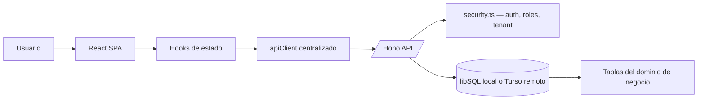

# Guia de replicacion arquitectonica — Patron reutilizable para sistemas transaccionales

## 1. Proposito de esta guia

Esta guia documenta el **patron arquitectonico reutilizable** extraido del proyecto Smart Logistics Extractor. No documenta la parte de IA (Gemini, prompts, extraccion documental) — eso es especifico de este proyecto y no se replica.

Lo que aqui se describe es la **metodologia y estructura** que conviene llevar a cualquier nuevo proyecto transaccional: un sistema web con interfaz React, backend API con Hono, base de datos relacional con libSQL/Turso, autenticacion robusta, y despliegue Docker en Coolify sobre Hetzner.

**Audiencia principal**: otro agente de Copilot (o un desarrollador) que necesite construir un proyecto nuevo siguiendo esta misma metodologia, sin importar el dominio de negocio.

---

## 2. Que se debe replicar y que no

### Si se debe replicar (patron estructural)

- separacion frontend, backend y persistencia
- React como SPA de operacion
- Hono como API ligera organizada por dominios de negocio
- libSQL como cliente unico de acceso SQL
- posibilidad de empezar con archivo local y luego migrar a Turso remoto
- autenticacion con sesiones persistidas en base de datos
- seguridad centralizada: hash scrypt, sesiones con expiracion, roles y contexto multi-tenant
- Docker multi-stage con una sola unidad de ejecucion
- despliegue simple en Coolify

### No se debe replicar (especifico de este proyecto)

- extraccion documental con IA
- prompts ni agentes de Gemini
- esquemas de salida de IA
- procesamiento batch orientado a documentos inteligentes

Cada nuevo proyecto define su propio dominio de negocio (bodega, ventas, inventario, CRM, lo que sea). Lo que se replica es la **metodologia y estructura**, no las pantallas ni las tablas especificas de este proyecto.

---

## 3. Vision arquitectonica generica

Cualquier nuevo proyecto construido con este patron deberia tener estas capas:

1. **React SPA** para la experiencia de operacion
2. **Hooks** para coordinar estado de aplicacion
3. **`apiClient` unico** para toda la comunicacion HTTP
4. **Backend Hono** organizado por dominio de negocio
5. **`db.ts`** como punto unico de acceso SQL con libSQL
6. **Docker** con una sola unidad de ejecucion



La ventaja de este patron es que mantiene el sistema pequeno, facil de desplegar, y suficientemente ordenado para crecer. No importa si el dominio es logistica, ventas, salud o cualquier otro — la estructura es la misma.

---

## 4. Autenticacion y seguridad — Explicacion profunda

Esta es la parte mas importante de replicar correctamente. El proyecto actual tiene un sistema de seguridad completo que funciona sin dependencias externas de auth (no Auth0, no Firebase Auth, no JWT). Todo vive en la propia base de datos.

### 4.1 Principios de seguridad del patron

- passwords nunca se almacenan en texto plano
- hash con `scrypt` (algoritmo incluido en Node.js `node:crypto`)
- comparacion con `timingSafeEqual` para prevenir timing attacks
- sesiones persistidas en base de datos, no en cookies ni localStorage (salvo backup del ID)
- expiracion automatica de sesiones (8 horas)
- control de acceso por rol (`ADMIN`, `OPERADOR`, `SUPERVISOR` u otros)
- control de acceso por contexto operativo (tenant, sede, sucursal, etc.)

### 4.2 Como funciona el hash de passwords

El formato almacenado en la base de datos es:

```
scrypt$<salt_hex>$<hash_hex>
```

Ejemplo real: `scrypt$a1b2c3d4e5f6....$9f8e7d6c5b4a....`

El flujo de creacion es:

```ts
import { randomBytes, scryptSync } from 'node:crypto';

function hashPassword(password: string): string {
  const salt = randomBytes(16).toString('hex');       // 16 bytes aleatorios
  const hash = scryptSync(password, salt, 64).toString('hex'); // 64 bytes de hash
  return `scrypt$${salt}$${hash}`;
}
```

El flujo de verificacion es:

```ts
import { scryptSync, timingSafeEqual } from 'node:crypto';

function verifyPassword(password: string, storedValue: string): boolean {
  const [, salt, hash] = storedValue.split('$');
  const expected = Buffer.from(hash, 'hex');
  const actual = Buffer.from(scryptSync(password, salt, 64).toString('hex'), 'hex');

  if (expected.length !== actual.length) return false;
  return timingSafeEqual(expected, actual);  // resistente a timing attacks
}
```

**Detalle importante**: el proyecto incluye migracion transparente de passwords legacy. Si un password aun esta en texto plano (de un seed inicial), el login lo detecta, verifica contra el texto plano, y **lo re-hashea automaticamente** con scrypt en el mismo request. Despues de ese login, el password ya queda seguro en la DB. Esto evita tener que correr scripts de migracion manuales.

### 4.3 Como funciona el sistema de sesiones

No se usan JWT ni cookies httpOnly. El mecanismo es un `session ID` opaco (UUID v4) almacenado en la tabla `auth_sessions`.

**Flujo completo de login:**

```
1. Cliente envia POST /api/auth/login con { email, password }
2. Backend busca usuario por email en table `users`
3. Backend verifica password con scrypt
4. Si el password estaba en texto plano, lo re-hashea en la DB
5. Verifica que el usuario este activo (is_active = 1)
6. Verifica que tenga al menos un contexto operativo activo (sede, agencia, etc.)
7. Genera session ID con crypto.randomUUID()
8. Calcula expiracion: Date.now() + 8 horas
9. Inserta en auth_sessions: { id, user_id, expires_at }
10. Responde con { session: { id, userId, expiresAt }, user: { ... } }
11. El frontend guarda el session ID en memoria y en localStorage como backup
```

**Flujo de cada request autenticado:**

```
1. apiClient lee el session ID de memoria (o localStorage como fallback)
2. Lo adjunta como header: X-Session-Id: <uuid>
3. Backend ejecuta requireAuth():
   a. Lee el header X-Session-Id
   b. Busca en auth_sessions WHERE id = ? AND expires_at > now
   c. Si no existe o expiro → 401
   d. Carga el usuario completo (id, email, name, role, is_active)
   e. Carga los contextos operativos del usuario (por ejemplo sus agencias/sedes)
   f. Si el usuario esta inactivo → 403
   g. Retorna el objeto AuthUser al endpoint
```

**Flujo de restauracion de sesion (recarga de pagina):**

```
1. El hook useAuth al montar llama restoreSession()
2. restoreSession() hace GET /api/auth/session con el X-Session-Id guardado
3. El backend valida la sesion (misma logica que requireAuth)
4. Si es valida, responde con los datos del usuario
5. El frontend restaura currentUser en el estado
6. Si la sesion expiro o es invalida, el frontend limpia el sessionId y muestra login
7. El flag sessionReady cambia a true para indicar que ya se intento restaurar
```

**Flujo de logout:**

```
1. Frontend llama api.logout() → DELETE /api/auth/session
2. Backend elimina la fila de auth_sessions
3. Frontend limpia sessionId de memoria y localStorage
4. Frontend pone currentUser = null → se muestra LoginScreen
```

### 4.4 Tabla de sesiones requerida

```sql
CREATE TABLE IF NOT EXISTS auth_sessions (
  id         TEXT PRIMARY KEY,   -- UUID v4
  user_id    TEXT NOT NULL REFERENCES users(id),
  created_at TEXT DEFAULT (datetime('now')),
  expires_at TEXT NOT NULL       -- datetime + 8 horas
);
```

### 4.5 Middlewares de seguridad

El patron centraliza toda la logica de permisos en `server/security.ts` con estas funciones:

| Funcion | Responsabilidad |
|---------|----------------|
| `hashPassword(password)` | Genera `scrypt$salt$hash` |
| `verifyPassword(password, stored)` | Verifica con timingSafeEqual |
| `requireAuth(c)` | Valida sesion, carga usuario, retorna AuthUser o 401/403 |
| `requireRole(c, user, roles[])` | Verifica que el usuario tenga uno de los roles permitidos |
| `ensureContextAccess(user, contextId)` | Verifica acceso al tenant/sede/sucursal. ADMIN puede acceder a todo. |

**Regla critica**: ningun endpoint debe implementar su propia logica de permisos. Todos usan estos helpers estandarizados. Ejemplo de un endpoint protegido:

```ts
route.get('/items', async (c) => {
  const userOrRes = await requireAuth(c);
  if (userOrRes instanceof Response) return userOrRes;  // 401 o 403

  const roleCheck = requireRole(c, userOrRes, ['ADMIN', 'OPERADOR']);
  if (roleCheck) return roleCheck;  // 403 si no tiene rol

  // ... logica de negocio
});
```

### 4.6 El apiClient y como inyecta la sesion automaticamente

En el frontend, un unico modulo `services/apiClient.ts` centraliza todas las llamadas HTTP. Su responsabilidad clave para seguridad:

```ts
let _sessionId: string | null = null;

function getSessionId(): string | null {
  if (_sessionId) return _sessionId;
  _sessionId = localStorage.getItem('app.sessionId'); // fallback
  return _sessionId;
}

async function request<T>(path: string, options: RequestInit = {}): Promise<T> {
  const headers: Record<string, string> = { 'Content-Type': 'application/json' };
  const sessionId = getSessionId();
  if (sessionId) {
    headers['X-Session-Id'] = sessionId;  // automatico en cada request
  }
  const response = await fetch(`/api${path}`, { ...options, headers });
  if (!response.ok) {
    const body = await response.json().catch(() => ({ error: response.statusText }));
    throw new ApiError(body.error || response.statusText, response.status);
  }
  return response.json();
}
```

**Puntos clave del apiClient:**
- nunca se pasa el sessionId manualmente desde los componentes — el apiClient lo inyecta siempre
- el sessionId vive en memoria (`_sessionId`) con localStorage como backup
- la clase `ApiError` encapsula errores HTTP con `status` y `message`
- el `login()` del apiClient guarda el sessionId que devuelve el backend
- el `logout()` del apiClient limpia el sessionId

Esta separacion es fundamental: **ningun componente React ni hook manipula headers HTTP directamente**. Todo pasa por el apiClient.

### 4.7 Tabla de usuarios requerida

Minimo necesario:

```sql
CREATE TABLE IF NOT EXISTS users (
  id         TEXT PRIMARY KEY,
  email      TEXT NOT NULL UNIQUE,
  name       TEXT NOT NULL,
  password   TEXT NOT NULL,        -- formato: scrypt$salt$hash
  role       TEXT NOT NULL DEFAULT 'OPERADOR',
  is_active  INTEGER NOT NULL DEFAULT 1,
  created_at TEXT DEFAULT (datetime('now')),
  updated_at TEXT DEFAULT (datetime('now'))
);
```

### 4.8 Tabla de relacion usuario-contexto (multi-tenant)

Para controlar a que sede, sucursal, agencia o tenant tiene acceso cada usuario:

```sql
CREATE TABLE IF NOT EXISTS user_contexts (
  user_id    TEXT NOT NULL REFERENCES users(id) ON DELETE CASCADE,
  context_id TEXT NOT NULL REFERENCES contexts(id) ON DELETE CASCADE,
  PRIMARY KEY (user_id, context_id)
);
```

El nombre de la tabla y de `contexts` se adapta al dominio (`user_agencies`, `user_warehouses`, `user_branches`, etc.).

---

## 5. Patron de frontend que conviene replicar

### 5.1 React como SPA operativa

El patron correcto es una SPA con un `App.tsx` principal que funcione como orquestador. No hace falta una arquitectura compleja desde el inicio. Lo importante es que el estado de alto nivel quede centralizado y que la logica reutilizable viva en hooks.

### 5.2 Responsabilidades del componente raiz

El `App.tsx` debe manejar:

- restauracion de sesion al montar (via `useAuth`)
- esperar `sessionReady` antes de renderizar — si no, el usuario ve un flash de LoginScreen
- usuario autenticado
- contexto operativo activo (sede, sucursal, agencia, etc.)
- modulo o pantalla activa

### 5.3 Hooks fundamentales que siempre se necesitan

| Hook | Responsabilidad | Detalles |
|------|----------------|----------|
| `useAuth` | Login, logout, restauracion de sesion | Retorna `currentUser`, `loginApi()`, `logout()`, `restoreSession()`, `sessionReady`, `isAdmin` |
| `useApiData` | Carga de catalogos comunes al montar | Hace `Promise.all` de las cargas iniciales, retorna datos + `loading` + `refresh()` |
| `useContextSelector` | Contexto operativo activo | Resuelve el contexto por defecto, persiste en localStorage, filtra segun permisos del usuario |
| `useDarkMode` | Tema visual | Opcional pero util — persiste en localStorage |

Ademas, cada modulo de negocio tendra sus propios hooks (ej: `useReceipts`, `useOrders`, `useProducts`). Lo importante es que **cada hook tiene una sola responsabilidad**.

### 5.4 Regla de separacion estricta

```
componente = interfaz visual y eventos de usuario
hook       = estado, logica de coordinacion, efectos
apiClient  = una sola puerta para HTTP (nunca fetch directo desde un hook)
```

Esta separacion es una de las mejores decisiones del proyecto actual y **debe** replicarse.

---

## 6. Patron de backend que conviene replicar

### 6.1 Hono como API ligera

Hono es adecuado cuando se quiere un backend pequeno, rapido y facil de leer. Funciona bien para cualquier sistema transaccional si se organiza por dominios de negocio y no por capas demasiado abstractas.

### 6.2 Estructura fija del backend (independiente del dominio)

Estos archivos siempre existen en cualquier proyecto que use este patron:

| Archivo | Responsabilidad |
|---------|----------------|
| `server/index.ts` | Arranque del servidor, CORS, montaje de rutas, SPA fallback |
| `server/db.ts` | Conexion unica a libSQL/Turso (singleton) |
| `server/schema.ts` | Creacion de tablas con `CREATE TABLE IF NOT EXISTS` |
| `server/seed.ts` | Datos iniciales idempotentes (admin, catalogos base) |
| `server/security.ts` | Hash, sesiones, requireAuth, requireRole, ensureContextAccess |
| `server/routes/auth.ts` | Login, sesion, logout |
| `server/routes/users.ts` | CRUD de usuarios |
| `server/routes/settings.ts` | Configuracion key-value de la app |

Luego, cada dominio de negocio agrega sus propios archivos de rutas. Ejemplo para bodega: `routes/warehouses.ts`, `routes/receipts.ts`, `routes/dispatches.ts`. Ejemplo para ventas: `routes/products.ts`, `routes/orders.ts`, `routes/customers.ts`. **El patron del backend no cambia — cambian los archivos de dominio.**

### 6.3 Secuencia de arranque del servidor

El `server/index.ts` ejecuta una funcion `start()` con esta secuencia exacta:

```
1. Crear directorio de datos si no existe:  fs.mkdirSync('data', { recursive: true })
2. Obtener conexion a DB:                   const db = getDb()
3. Ejecutar migraciones:                    await runMigrations(db)
4. Ejecutar seed:                           await runSeed(db)
5. Iniciar servidor HTTP:                   serve({ fetch: app.fetch, port })
```

**Esto es critico**: las migraciones corren ANTES del seed, y ambos corren ANTES de aceptar requests. Si un agente no respeta esta secuencia, el sistema va a fallar en el primer despliegue.

### 6.4 Patron de migraciones con CREATE IF NOT EXISTS

No se usa un sistema de migraciones versionado (como Prisma migrations o Drizzle). En su lugar, `schema.ts` declara todas las tablas como `CREATE TABLE IF NOT EXISTS` y las ejecuta secuencialmente al arrancar.

```ts
const SCHEMA_STATEMENTS: string[] = [
  `CREATE TABLE IF NOT EXISTS users ( ... )`,
  `CREATE TABLE IF NOT EXISTS auth_sessions ( ... )`,
  // ... tablas del dominio
];

export async function runMigrations(db: Client): Promise<void> {
  await db.execute('PRAGMA journal_mode = WAL');
  await db.execute('PRAGMA foreign_keys = ON');
  for (const statement of SCHEMA_STATEMENTS) {
    await db.execute(statement);
  }
}
```

**PRAGMAs obligatorios:**
- `journal_mode = WAL` — permite lecturas concurrentes sin bloquear escrituras
- `foreign_keys = ON` — sin esto, las REFERENCES en las tablas no se validan (SQLite las ignora por defecto)

### 6.5 Patron de seed idempotente

El seed verifica si ya hay datos **antes** de insertar:

```ts
export async function runSeed(db: Client): Promise<void> {
  const count = await db.execute('SELECT COUNT(*) as cnt FROM users');
  if (Number(count.rows[0].cnt) > 0) {
    return; // ya hay datos — no hacer nada
  }

  // Insertar admin inicial, catalogos base, etc.
  await db.batch([
    { sql: 'INSERT INTO users (...) VALUES (...)', args: [...] },
    // ...
  ]);
}
```

Esto permite que el contenedor se reinicie sin duplicar datos. **El agente debe replicar este patron exacto** — si el seed no es idempotente, cada redeploy en Coolify va a fallar o duplicar registros.

### 6.6 Endpoint de health check

Siempre incluir:

```ts
app.get('/api/health', (c) => c.json({
  status: 'ok',
  db: 'libsql',
  time: new Date().toISOString()
}));
```

Coolify usa este endpoint para saber si el contenedor esta sano.

### 6.7 Servir SPA en produccion

En produccion, el mismo servidor Hono sirve los archivos estaticos del frontend compilado:

```ts
const distPath = path.resolve(process.cwd(), 'dist');
if (fs.existsSync(distPath)) {
  app.use('/*', serveStatic({ root: './dist' }));
  // Fallback: cualquier ruta no-API sirve index.html (SPA routing)
  app.get('*', async (c) => {
    const html = fs.readFileSync(path.join(distPath, 'index.html'), 'utf-8');
    return c.html(html);
  });
}
```

En desarrollo, Vite hace proxy de `/api` al backend. En produccion, todo corre en un solo proceso.

---

## 7. Como funciona Turso y la libreria libSQL

### 7.1 Diferencia entre Turso y libSQL

- `libSQL` es la libreria y el motor compatible con SQLite
- `Turso` es el servicio remoto administrado con bases compatibles con libSQL

Localmente se trabaja con un archivo SQLite usando libSQL. En produccion se puede seguir usando libSQL pero apuntando a una base remota en Turso. **La aplicacion casi no cambia entre desarrollo y produccion.** Cambia la URL de conexion, no el patron del codigo.

### 7.2 Libreria: `@libsql/client`

Patron completo del singleton de conexion:

```ts
import { createClient, type Client } from '@libsql/client';

let _client: Client | null = null;

function getConfig() {
  return {
    url: process.env.TURSO_DATABASE_URL || 'file:./data/app.db',
    authToken: process.env.TURSO_AUTH_TOKEN || undefined,
  };
}

export function getDb(): Client {
  if (!_client) {
    const config = getConfig();
    _client = createClient({ url: config.url, authToken: config.authToken });
  }
  return _client;
}

export async function closeDb(): Promise<void> {
  if (_client) { _client.close(); _client = null; }
}
```

**Puntos clave:**
- singleton — una sola instancia por proceso
- la URL determina el modo: `file:` = local, `libsql://` = remoto
- `authToken` solo se necesita para Turso remoto
- `closeDb()` existe para shutdown limpio

### 7.3 Modos de conexion

| Modo | TURSO_DATABASE_URL | TURSO_AUTH_TOKEN | Cuando usarlo |
|------|-------------------|-----------------|---------------|
| Local | `file:./data/app.db` | (vacio) | Desarrollo, testing, inicio rapido |
| Turso remoto | `libsql://tu-db.turso.io` | `token_real` | Produccion, separar app y DB |

### 7.4 Buenas practicas con libSQL

- **queries parametrizadas siempre** — nunca interpolar valores del usuario en SQL
- `db.batch([...])` para multiples escrituras atomicas
- `PRAGMA foreign_keys = ON` — sin esto las foreign keys no se validan
- `PRAGMA journal_mode = WAL` — permite lecturas concurrentes
- indices desde el inicio para campos de busqueda frecuentes

### 7.5 Como dejar Turso online listo desde el dia uno

La arquitectura correcta no es elegir entre local o remoto como si fueran dos proyectos distintos. Es dejar desde el inicio una sola capa de acceso a datos que soporte ambos modos:

- un solo archivo `server/db.ts`
- una sola libreria `@libsql/client`
- una sola variable `TURSO_DATABASE_URL`
- una variable opcional `TURSO_AUTH_TOKEN`
- ninguna consulta SQL fuera de la capa backend

Para pasar de local a Turso online: **solo se cambian variables de entorno**. No se reescribe codigo.

### 7.6 Paso a paso para habilitar Turso online

1. Crear la base remota en Turso
2. Obtener la URL `libsql://...`
3. Generar token de acceso
4. Configurar `TURSO_DATABASE_URL` y `TURSO_AUTH_TOKEN` en Coolify
5. Desplegar la misma aplicacion sin cambiar codigo
6. Validar login, escritura y lectura

### 7.7 Reglas de diseño para facilitar el cambio a Turso

- no usar drivers SQL diferentes segun entorno
- no meter logica SQL en React ni en hooks
- no acoplar rutas a la idea de archivo local
- no hardcodear tokens ni URLs
- no asumir que la base siempre vivira dentro del contenedor

---

## 8. Modelo de datos — Estructura generica

Cada proyecto define su propio dominio, pero el patron de tablas siempre se divide en dos capas.

### 8.1 Tablas de infraestructura (siempre presentes)

Estas tablas existen en **todo** proyecto que use este patron:

| Tabla | Proposito |
|-------|-----------|
| `users` | Usuarios del sistema (email, name, password scrypt, role, is_active) |
| `auth_sessions` | Sesiones activas (id UUID, user_id, expires_at) |
| `user_contexts` | Relacion M:N entre usuario y contexto operativo (agencia, sede, sucursal) |
| `contexts` | Entidades del tenant/sede (agencias, bodegas, sucursales — el nombre cambia por dominio) |
| `app_settings` | Configuracion key-value de la aplicacion |

### 8.2 Tablas de dominio (cambian por proyecto)

Estas tablas dependen del negocio. Ejemplo comparativo:

| Dominio Bodega | Dominio Ventas | Dominio Clinica |
|---------------|---------------|-----------------|
| `warehouses` | `stores` | `clinics` |
| `receipts` | `orders` | `appointments` |
| `receipt_items` | `order_items` | `consultations` |
| `dispatches` | `invoices` | `prescriptions` |
| `inventory_movements` | `payments` | `medical_records` |
| `package_types` | `product_categories` | `specialties` |

**Lo que no cambia es la estructura**: tablas maestras + tablas operativas + tablas de historial/trazabilidad. El agente debe diseñar las tablas del dominio, no copiar las de otro proyecto.

### 8.3 Patron comun: tabla de historial/trazabilidad

Todo proyecto transaccional necesita una tabla de historial donde cada cambio relevante crea un registro. No se recalcula el estado desde cero — se consulta el ultimo estado registrado.

```sql
CREATE TABLE IF NOT EXISTS activity_log (
  id         INTEGER PRIMARY KEY AUTOINCREMENT,
  entity_type TEXT NOT NULL,     -- 'receipt', 'order', 'appointment'
  entity_id   TEXT NOT NULL,
  action       TEXT NOT NULL,     -- 'CREATED', 'UPDATED', 'STATUS_CHANGED', etc.
  user_id      TEXT NOT NULL REFERENCES users(id),
  details      TEXT,              -- JSON opcional con datos del cambio
  created_at   TEXT DEFAULT (datetime('now'))
);
CREATE INDEX IF NOT EXISTS idx_activity_entity ON activity_log(entity_type, entity_id);
```

---

## 9. Flujos funcionales genericos

### 9.1 Flujo de arranque de la aplicacion

```text
1. Usuario abre la app
2. React monta App.tsx
3. useAuth ejecuta restoreSession()
4. Si hay sessionId → GET /api/auth/session → valida → restaura currentUser
5. Si no hay sessionId o es invalido → muestra LoginScreen
6. sessionReady = true → se renderiza la app completa
7. useApiData carga catalogos base (usuarios, contextos, configuracion)
8. useContextSelector resuelve el contexto activo (sede, agencia, etc.)
9. Se muestra el dashboard o modulo por defecto
```

### 9.2 Flujo de login

```text
1. Usuario ingresa email y password
2. POST /api/auth/login
3. Backend valida credenciales, crea sesion en DB (8h)
4. Frontend recibe { session, user }
5. apiClient guarda sessionId
6. App navega al dashboard
7. Todos los requests futuros llevan X-Session-Id automaticamente
```

### 9.3 Flujo de operacion transaccional (generico)

```text
1. Usuario autenticado entra a un modulo (crear orden, registrar ingreso, etc.)
2. Completa formulario y envia
3. apiClient hace POST /api/{dominio}
4. Backend ejecuta requireAuth → requireRole → valida datos
5. Backend inserta en DB con queries parametrizadas
6. Backend registra en activity_log
7. Backend responde con el recurso creado
8. Hook actualiza el estado local
9. Componente refleja el cambio
```

### 9.4 Flujo de consulta

```text
1. Usuario busca por filtro (fecha, codigo, cliente, etc.)
2. apiClient hace GET /api/{dominio}?filters
3. Backend usa indices para responder rapido
4. Frontend muestra resultados
5. Usuario puede abrir el detalle e historial de cualquier registro
```

---

## 10. Fases de construccion para un nuevo proyecto

Este es el orden recomendado para construir cualquier proyecto nuevo con este patron.

### 10.1 Fase 1: definir dominio

Antes de escribir codigo, definir:

- cuales son las entidades principales del negocio
- que estados puede tener cada entidad
- que campos son obligatorios
- como se identifica el contexto operativo (sede, sucursal, tienda)
- que roles existen y que permisos tiene cada uno

### 10.2 Fase 2: diseñar base de datos

- tablas de infraestructura (users, auth_sessions, user_contexts, app_settings)
- tablas del dominio (segun el negocio)
- tabla de historial/trazabilidad
- claves foraneas, indices, restricciones de unicidad

### 10.3 Fase 3: diseñar endpoints

**Siempre presentes:**

- `POST /api/auth/login`
- `GET /api/auth/session`
- `DELETE /api/auth/session`
- `GET /api/health`
- CRUD de `users`
- CRUD de `settings`

**Del dominio** — varian por proyecto:

- CRUD de cada entidad principal
- endpoints de consulta con filtros
- endpoints de historial/trazabilidad

### 10.4 Fase 4: diseñar frontend

Orden de construccion:

1. LoginScreen
2. Layout base con navegacion
3. Selector de contexto operativo
4. Dashboard inicial
5. Modulos del dominio (CRUD de cada entidad)
6. Consulta e historial
7. Administracion de usuarios

### 10.5 Fase 5: empaquetado y despliegue

Desde el inicio:

- Dockerfile multi-stage
- `docker-compose.yml`
- `/api/health` endpoint
- variables de entorno correctas
- carpeta persistente de datos local si no se usa Turso aun

---

## 11. Como desplegarlo en Coolify sobre Hetzner

### 11.1 Estrategia: un solo servicio

Desplegar un solo servicio que sirva:

- frontend compilado (archivos estaticos)
- backend API (Hono)

Elegir una de estas dos estrategias para base de datos:

| Estrategia | Variable | Ideal para |
|-----------|----------|------------|
| Base local persistente | `file:./data/app.db` + volumen en `/app/data` | Inicio, carga moderada |
| Turso remoto | `libsql://...` + `TURSO_AUTH_TOKEN` | Produccion, separar app y DB |

### 11.2 Dockerfile recomendado

Mantener el mismo patron:

- etapa `builder` con `node:20-alpine` para compilar frontend (`npm run build`)
- etapa `runner` con solo dependencias de produccion (`npm ci --omit=dev`)
- copiar `dist/`, `server/` y archivos compartidos necesarios
- crear directorio `/app/data`
- exponer puerto `3001`

### 11.3 Variables de entorno

```env
PORT=3001
TURSO_DATABASE_URL=file:./data/app.db
TURSO_AUTH_TOKEN=
APP_ENV=production
```

Para Turso remoto, solo cambiar:

```env
TURSO_DATABASE_URL=libsql://mi-db-mi-org.turso.io
TURSO_AUTH_TOKEN=token_real
```

### 11.4 Configuracion en Coolify

- metodo de despliegue: Dockerfile del repo
- puerto interno: `3001`
- healthcheck: `/api/health`
- volumen persistente: `/app/data` (si base local)
- reinicio automatico: activado

#### Escenario A: Coolify con base local

- app en contenedor, base en `/app/data/app.db`
- Coolify monta volumen persistente
- reiniciar contenedor no pierde datos

#### Escenario B: Coolify con Turso online

- contenedor igual, sin volumen obligatorio para DB
- Coolify inyecta `TURSO_DATABASE_URL` y `TURSO_AUTH_TOKEN`
- backend usa la misma capa `db.ts`

### 11.5 Paso a paso de despliegue

1. preparar repo con Dockerfile y `docker-compose.yml`
2. definir variables de entorno
3. si base local, montar volumen persistente en `/app/data`
4. conectar el repo en Coolify
5. desplegar usando el Dockerfile
6. validar `200 OK` en `/api/health`
7. entrar al sistema y probar login
8. probar una operacion de escritura
9. probar una consulta
10. revisar que los datos queden persistidos

---

## 12. Contrato de replicacion — Lo que el agente debe validar

Si otro agente va a construir un proyecto nuevo con este patron, **debe validar explicitamente estos puntos** antes de dar la arquitectura por correcta:

### 12.1 Checklist de arquitectura (obligatorio)

- [ ] existe `server/db.ts` como unica capa de acceso SQL
- [ ] esa capa soporta `file:` y `libsql://` por variable de entorno
- [ ] existe `server/security.ts` con hashPassword, verifyPassword, requireAuth, requireRole
- [ ] la autenticacion usa sesiones persistidas en tabla `auth_sessions`
- [ ] las sesiones usan UUID y header `X-Session-Id` (no cookies, no JWT)
- [ ] el hash de passwords usa scrypt con salt y timingSafeEqual
- [ ] existe migracion transparente de passwords legacy en el login
- [ ] existe control de roles (ADMIN, OPERADOR, SUPERVISOR o equivalentes)
- [ ] existe control de contexto operativo por tenant/sede/sucursal
- [ ] el frontend usa un `apiClient` unico — ningun componente hace fetch directo
- [ ] el apiClient inyecta `X-Session-Id` automaticamente en cada request
- [ ] `useAuth` restaura la sesion al montar y expone `sessionReady`
- [ ] ningun hook ni componente accede a SQL directamente
- [ ] los modulos estan separados por dominio de negocio
- [ ] `server/schema.ts` usa `CREATE TABLE IF NOT EXISTS` y corre PRAGMAs
- [ ] `server/seed.ts` es idempotente (verifica antes de insertar)
- [ ] la secuencia de arranque es: mkdir → getDb → migrations → seed → serve
- [ ] existe `GET /api/health` que retorna status ok
- [ ] el Dockerfile es multi-stage (builder + runner)
- [ ] en produccion, el mismo proceso sirve SPA y API
- [ ] el despliegue funciona igual con base local o con Turso online
- [ ] las variables de entorno controlan el cambio de modo

Si alguno de estos puntos falla, **no se esta replicando correctamente el patron**.

### 12.2 Checklist de seguridad (obligatorio)

- [ ] passwords nunca se almacenan en texto plano (excepto durante migracion automatica)
- [ ] no se interpolan valores del usuario en SQL (siempre queries parametrizadas)
- [ ] no se exponen errores internos al cliente (solo mensajes genericos)
- [ ] endpoints protegidos validan sesion antes de cualquier logica
- [ ] roles se validan en el backend, nunca confiando en el frontend
- [ ] el contexto operativo se valida en el backend para cada operacion

---

## 13. Prompt generico para usar con el agente en un nuevo proyecto

```text
Quiero que construyas un sistema transaccional web siguiendo este patron arquitectonico:

Requisitos de arquitectura:
- frontend React + TypeScript + Vite como SPA
- App.tsx como orquestador central (sesion, rol, contexto activo)
- hooks separados por responsabilidad (useAuth, useApiData, useContextSelector, y hooks del dominio)
- apiClient centralizado que inyecta X-Session-Id automaticamente
- backend Hono (Node.js) organizado por dominios de negocio
- base de datos con @libsql/client (singleton en server/db.ts)
- soporte dual: file:./data/app.db para local y libsql:// para Turso remoto, controlado por variables de entorno
- seguridad centralizada en server/security.ts:
  - hash scrypt con salt y timingSafeEqual
  - sesiones en tabla auth_sessions (UUID, 8h expiracion)
  - requireAuth, requireRole, ensureContextAccess
  - migracion transparente de passwords legacy
- schema.ts con CREATE TABLE IF NOT EXISTS y PRAGMAs (WAL, foreign_keys)
- seed.ts idempotente (verifica antes de insertar)
- secuencia de arranque: mkdir data → getDb → migrations → seed → serve
- Dockerfile multi-stage (node:20-alpine)
- GET /api/health para monitoring
- despliegue en Coolify sobre Hetzner

El dominio de negocio es: [DESCRIBIR AQUI EL DOMINIO]

Adapta las tablas y rutas al dominio, pero respeta la estructura y metodologia descritas.
```

### 13.1 Prompt para validar que el patron se replico bien

```text
Valida si este proyecto replica correctamente este patron arquitectonico:

1. Arquitectura: React+Vite SPA → hooks → apiClient → Hono API → security.ts → db.ts → libSQL
2. Seguridad: scrypt con salt, timingSafeEqual, sesiones en DB (UUID + X-Session-Id), requireAuth/requireRole/ensureContextAccess, migracion transparente de passwords legacy
3. Base de datos: singleton @libsql/client, soporte dual file:/libsql://, PRAGMAs WAL y foreign_keys, CREATE TABLE IF NOT EXISTS, seed idempotente
4. Arranque: mkdir → getDb → migrations → seed → serve
5. Despliegue: Docker multi-stage, /api/health, SPA y API en un solo proceso, compatible Coolify

Si algo no cumple, indica exactamente que falta.
```

---

## 14. Conclusiones practicas

Lo que vale la pena replicar de este proyecto no es el dominio especifico ni la parte de IA. Es la **metodologia**:

- SPA operativa clara con hooks por responsabilidad
- backend pequeno y ordenado con Hono por dominios
- seguridad robusta y centralizada (scrypt, sesiones en DB, roles, multi-tenant)
- SQL directo y mantenible con libSQL
- posibilidad de empezar local y migrar a Turso sin tocar codigo
- despliegue simple y barato en Coolify sobre Hetzner

Esta arquitectura es aplicable a cualquier sistema transaccional: bodega, ventas, clinica, CRM, logistica. Lo que cambia es el dominio de negocio. Lo que se replica es la **estructura, la seguridad, y la metodologia de despliegue**.