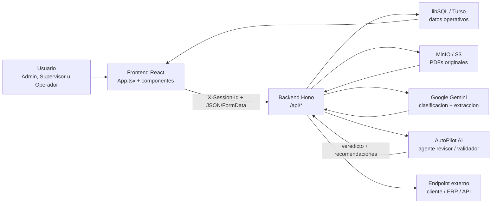
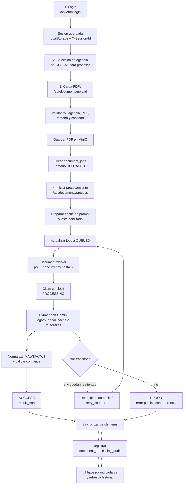
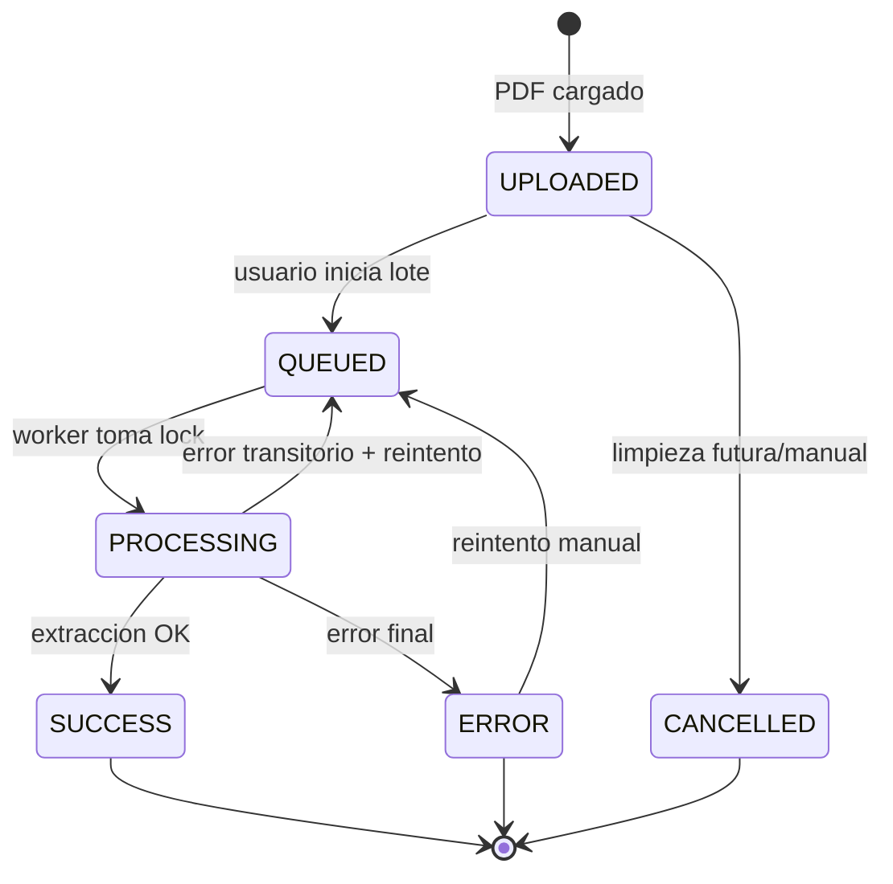
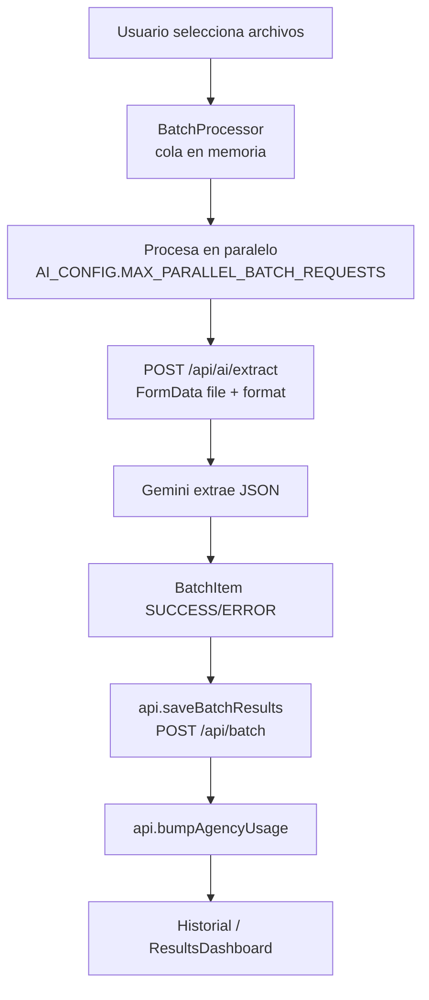
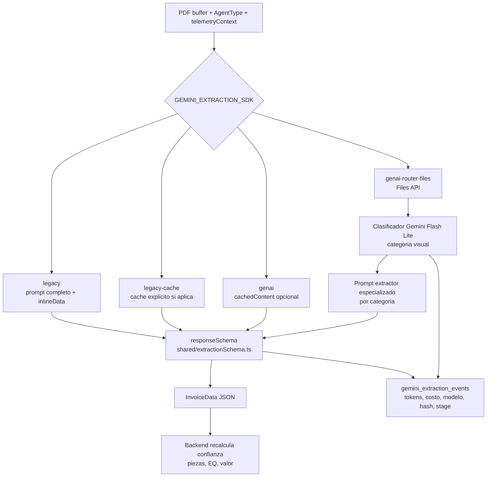
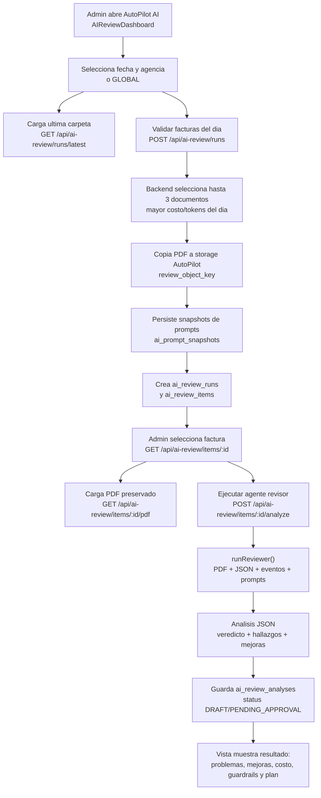
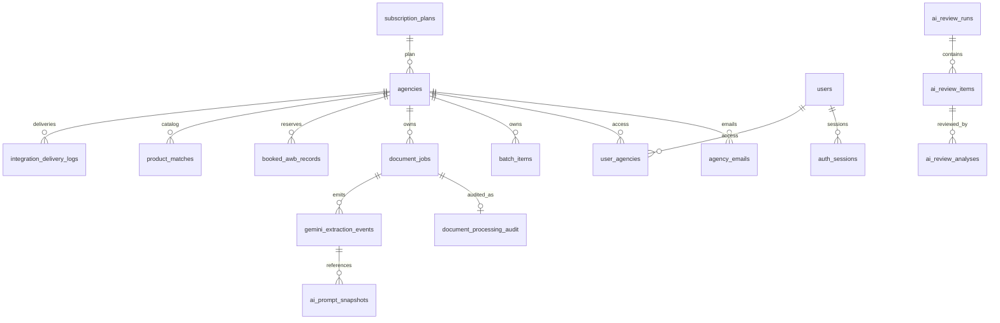

# Flujograma y Arquitectura del Producto

Este documento resume como funcionan las piezas principales de Smart Logistics Extractor: desde que una agencia carga facturas PDF hasta que el sistema extrae datos, valida, guarda historial, permite revisión humana/IA y entrega la información a integraciones externas.

## 1. Vista ejecutiva del producto

Smart Logistics Extractor es una plataforma multi-agencia para convertir facturas logisticas en PDF en datos estructurados listos para operar, auditar, homologar productos y enviar a sistemas externos.

## 2. Componentes clave

| Capa               | Componentes                                                                                                                                    | Responsabilidad                                                                                                                     |
| ------------------ | ---------------------------------------------------------------------------------------------------------------------------------------------- | ----------------------------------------------------------------------------------------------------------------------------------- |
| Experiencia        | `App.tsx`, `Sidebar`, `LoginScreen`, `DocumentProcessingWorkspace`, `ResultsDashboard`, `OperatorPanel`, `AdminDashboard`, `AIReviewDashboard` | Navegacion por rol, seleccion de agencia, carga de PDFs, seguimiento de lotes, historial, paneles operativos/admin.                 |
| Estado frontend    | `hooks/index.ts`                                                                                                                               | Sesion, agencia actual, carga de usuarios/agencias/planes, batch results, tema oscuro.                                              |
| API client         | `services/apiClient.ts`                                                                                                                        | Centraliza llamadas `/api`, agrega `X-Session-Id`, maneja JSON/FormData, errores y cache de catalogos.                              |
| Backend API        | `server/index.ts`, `server/routes/*`                                                                                                           | Monta rutas Hono, CORS, healthcheck, migraciones, seed, worker y SPA en produccion.                                                 |
| Seguridad          | `server/security.ts`, `auth_sessions`                                                                                                          | Autenticacion por sesion, control de roles y acceso por agencia.                                                                    |
| Persistencia       | `server/schema.ts`, `server/db.ts`                                                                                                             | Tablas de usuarios, agencias, planes, documentos, batches, auditoria, eventos Gemini, AutoPilot AI, integraciones y producto-match. |
| Almacenamiento PDF | `server/services/minioService.ts`                                                                                                              | Guarda PDFs originales y copias de revision AutoPilot.                                                                              |
| Extraccion IA      | `server/services/documentExtractionService.ts`, `services/agentPrompts.ts`, `shared/extractionSchema.ts`                                       | Construye prompts, selecciona SDK/modo, llama Gemini, fuerza JSON, registra tokens/costo/eventos.                                   |
| Worker             | `server/workers/documentWorker.ts`                                                                                                             | Procesa `document_jobs` en background con concurrencia, locks, reintentos y auditoria.                                              |
| Homologacion       | `product-matches`, `product_match_master`, `PendingProductMatches`, `ProductMatchCatalog`                                                      | Detecta productos sin match y permite crear/importar catalogos por agencia.                                                         |
| Integracion        | `server/routes/integrate.ts`, `shared/integrationConfig.ts`                                                                                    | Mapea campos y envia documentos procesados a endpoints externos con logs.                                                           |
| Mejora continua    | `server/routes/ai-review.ts`, `AIReviewDashboard`                                                                                              | Selecciona documentos costosos/relevantes, conserva evidencia, revisa PDF + JSON + eventos + prompts y propone mejoras.             |
| Agente validador   | `POST /api/ai-review/items/:id/analyze`, `runReviewer()`                                                                                       | Valida una factura desde AutoPilot AI comparando PDF, JSON extraido, eventos Gemini y prompts usados.                               |

## 3. Flujo principal recomendado: procesamiento en cola

Este es el flujo moderno usado por `DocumentProcessingWorkspace`. Es el mas robusto porque guarda los PDFs, permite seguimiento por estado y procesa en background.

### Estados de un documento

## 4. Flujo alterno: extraccion directa legacy

`BatchProcessor` todavia conserva un camino directo para procesar archivos desde el navegador contra `/api/ai/extract`. Este camino no pasa por MinIO ni por `document_jobs`.

## 5. Subflujo IA: clasificacion, extraccion y observabilidad

## 6. Flujo AutoPilot AI: agente validador/revisor

AutoPilot AI tiene una vista admin dedicada para validar muestras de facturas ya procesadas. La pantalla no cambia automaticamente el extractor; crea evidencia, ejecuta un agente revisor y deja recomendaciones para aprobacion humana.

### Que valida el agente revisor

- Compara visualmente el PDF contra el `InvoiceData` extraido.
- Revisa eventos Gemini: modelo, etapa, prompt hash, tokens, costo y errores.
- Lee snapshots de prompts para saber si fue clasificador, extractor general o extractor por categoria.
- Devuelve un veredicto: `OK`, `REVIEW_NEEDED` o `PROMPT_IMPROVEMENT_SUGGESTED`.
- Reporta campos sospechosos, severidad y razones.
- Sugiere mejoras separadas para extractor y clasificador.
- Incluye impacto de costo antes de proponer prompts mas largos, mas llamadas o modelos mas caros.
- Entrega guardrails de costo y plan de validacion.
- Marca si requiere trabajo de desarrollo cuando implica cambiar schema, categoria o logica.

### Datos que alimentan la vista AutoPilot

| Bloque de la vista  | Fuente                                                                                |
| ------------------- | ------------------------------------------------------------------------------------- |
| Lista de muestras   | `ai_review_runs` + `ai_review_items`                                                  |
| PDF embebido        | PDF original copiado a `review_object_key` o PDF fuente de `document_jobs.object_key` |
| Resultado extraido  | `document_jobs.result_json` o `batch_items.result_json`                               |
| Eventos Gemini      | `gemini_extraction_events` filtrado por `document_job_id`                             |
| Prompts usados      | `ai_prompt_snapshots` unidos por `prompt_hash`                                        |
| Analisis del agente | `ai_review_analyses.analysis_json`                                                    |

## 7. Funcionalidades del super producto

### Operacion diaria

- Login con sesion persistida en `auth_sessions`.
- Contexto multi-agencia con vista `GLOBAL` solo para consulta admin.
- Carga de hasta 40 PDFs por lote en el workspace moderno.
- Procesamiento paralelo en background, con cola, locks y recuperacion de jobs interrumpidos.
- Historial de facturas extraidas por agencia.
- Panel facturado para operadores.
- Conciliacion operacional de MAWB contra registros reservados (`booked_awb_records`) y facturados desde extracciones.

### Administracion

- Gestion de usuarios por rol: `ADMIN`, `OPERADOR`, `SUPERVISOR`.
- Gestion de agencias, planes, estado activo, uso mensual y patron HAWB.
- Configuracion de integraciones por agencia.
- Vista global para administradores.
- Seed inicial de planes, usuarios y catalogo maestro de producto-match.

### Extraccion inteligente

- Prompt centralizado por agente en `services/agentPrompts.ts`.
- Schema estricto compartido en `shared/extractionSchema.ts`.
- Normalizacion de airway bills con reglas por agencia.
- Scoring de confianza y razones de penalizacion.
- Soporte de varios modos Gemini para comparar costo, estabilidad y precision.
- Telemetria de eventos Gemini con tokens, duracion, costo estimado, prompt hash, modelo y etapa.

### Homologacion de productos

- Catalogo por agencia en `product_matches`.
- Catalogo maestro en `product_match_master`.
- Deteccion de productos extraidos sin equivalencia desde `batch_items`.
- Alta manual de matches pendientes.
- Descarga/importacion de plantilla Excel.
- Bootstrap de catalogo por agencia desde maestro.

### Integraciones externas

- Configuracion por agencia: URL, metodo `POST`/`PUT`, auth `none`, `bearer`, `apiKey` o `basic`, headers extra y field mappings.
- Prueba de endpoint con documentos de ejemplo.
- Envio real desde historial/panel.
- Logs de entrega en `integration_delivery_logs` con status, respuesta, fuente y referencia.

### AutoPilot AI y mejora continua

- Selecciona hasta 3 documentos procesados por fecha/agencia, priorizando mayor costo/tokens.
- Copia PDFs a almacenamiento de revision para preservar evidencia.
- Guarda snapshots de prompts usados durante extraccion.
- Permite ejecutar el agente revisor desde la vista AutoPilot AI.
- Revisa PDF + JSON extraido + eventos Gemini + prompts.
- Genera analisis con veredicto, hallazgos, recomendaciones tecnicas, impacto de costo y plan de validacion.
- Guarda analisis en `ai_review_analyses` sin modificar automaticamente prompts operativos.

## 8. Modelo de datos esencial

## 9. Rutas API por dominio

| Dominio            | Rutas                                                                                                                                                                                    |
| ------------------ | ---------------------------------------------------------------------------------------------------------------------------------------------------------------------------------------- |
| Salud              | `GET /api/health`                                                                                                                                                                        |
| Auth               | `POST /api/auth/login`, `GET /api/auth/session`, `DELETE /api/auth/session`                                                                                                              |
| Usuarios           | `GET/POST /api/users`, `GET/PUT/DELETE /api/users/:id`                                                                                                                                   |
| Agencias           | `GET/POST /api/agencies`, `GET/PUT/DELETE /api/agencies/:id`, `PATCH /api/agencies/:id/usage`                                                                                            |
| Planes             | `GET /api/plans`                                                                                                                                                                         |
| Documentos         | `GET /api/documents`, `POST /api/documents/upload`, `POST /api/documents/process`, `GET /api/documents/status/:id`, `GET /api/documents/:id/preview`, `DELETE /api/documents`            |
| Extraccion directa | `POST /api/ai/extract`, `POST /api/ai/compare`, `GET /api/ai/cache-status`, `POST /api/ai/cache-warm`                                                                                    |
| Batches            | `GET/POST/DELETE /api/batch`, `PUT /api/batch/:id`, `DELETE /api/batch/items`                                                                                                            |
| Auditoria          | `GET /api/audit/document-processing`, `GET /api/audit/gemini-extraction-events`                                                                                                          |
| AutoPilot AI       | `GET/POST /api/ai-review/runs`, `GET /api/ai-review/runs/latest`, `GET /api/ai-review/items/:id`, `GET /api/ai-review/items/:id/pdf`, `POST /api/ai-review/items/:id/analyze`            |
| Producto-match     | `GET/POST /api/product-matches`, `GET/POST /api/product-matches/pending`, `POST /api/product-matches/bootstrap`, `GET /api/product-matches/template`, `POST /api/product-matches/import` |
| Operacional        | `GET /api/operational/reconciliation`, `POST /api/operational/booked`                                                                                                                    |
| Integracion        | `POST /api/integrate/test`, `POST /api/integrate/send`, `GET /api/integrate/logs/:agencyId`                                                                                              |
| Settings           | `GET/PUT /api/settings/:key`                                                                                                                                                             |

## 10. Como leer el flujo completo

1. El usuario entra, se autentica y selecciona agencia.
2. La UI consulta datos base: usuarios, agencias, planes, historiales y documentos.
3. Para procesar facturas, se cargan PDFs a MinIO y se registran como `document_jobs`.
4. Al iniciar el lote, los jobs pasan a `QUEUED`.
5. El worker toma jobs, llama Gemini, valida/normaliza y guarda resultados.
6. El resultado se refleja en `batch_items`, `document_processing_audit` y en el historial de la UI.
7. Desde los datos extraidos se puede:
   - revisar y corregir resultados,
   - detectar producto-match pendiente,
   - conciliar MAWB/facturado contra reservado,
   - exportar/enviar a integracion externa,
   - alimentar AutoPilot AI para mejora continua.
8. En AutoPilot AI, el admin puede crear una muestra del dia y ejecutar el agente revisor para validar PDF, JSON, eventos y prompts antes de decidir mejoras.
